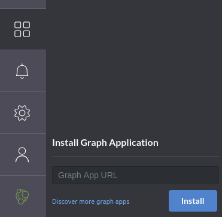
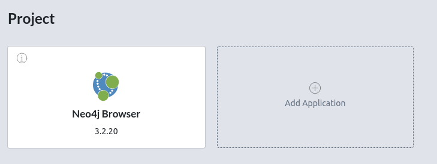

  
  <h2 align="center">neomap</h2>
  

    
    
    
  

A Neo4J Desktop (React-based) application to visualize nodes with geographical attributes on a map.

## Installation

### Add the app to Neo4jDesktop

#### From NPM package URL (Recommended)

1. Open neo4j desktop and go to "Graph Applications" view:

   

2. Paste the following link in the text input:

   https://registry.npmjs.org/neomap

#### From tarball

1. Go to the repository [releases](https://github.com/stellasia/neomap/releases)
2. Download the `neomap-<version>.tar.gz`
3. Open neo4j desktop and go to "Graph Applications" view (see image in previous section)
4. Drag and drop the tarball you downloaded earlier below "Install Graph Application"
5. Trust the application
6. The application is now available and you can add it to your projects:

   

7. Click "Add"

   

## Usage

Read the [tutorial](https://github.com/stellasia/neomap/wiki/NeoMap-Tutorial/) or the [FAQ](https://github.com/stellasia/neomap/wiki/FAQ).

## Want to contribute?

See [CONTRIBUTING.md](CONTRIBUTING.md).

### WARNING

I am a data scientist, not a front-end developer. If someone with expertise with React wants to take a look and suggest improvements, that would be very welcome!

### Developer mode

1.  Clone this repo

2.  Install dependencies:

        npm install

3.  Start the development server:

        npm run start

4.  Configure Neo4jDesktop by enabling the development mode in settings with the following parameters:

    - Entry point: `http://localhost:3000`
    - Root path: root of this repository

5.  Run tests: install dev dependencies and

        npm run test

### Build for release (TODO: add this to CI?)

1. Make sure the version in package.json is correct
2. Build:

   npm run build

3. Create tgz package:

   npm pack

4. Publish to NPM: (after npm login):

   `npm publish neomap-<VERSION>.tgz # --registry=https://registry.npmjs.org`
